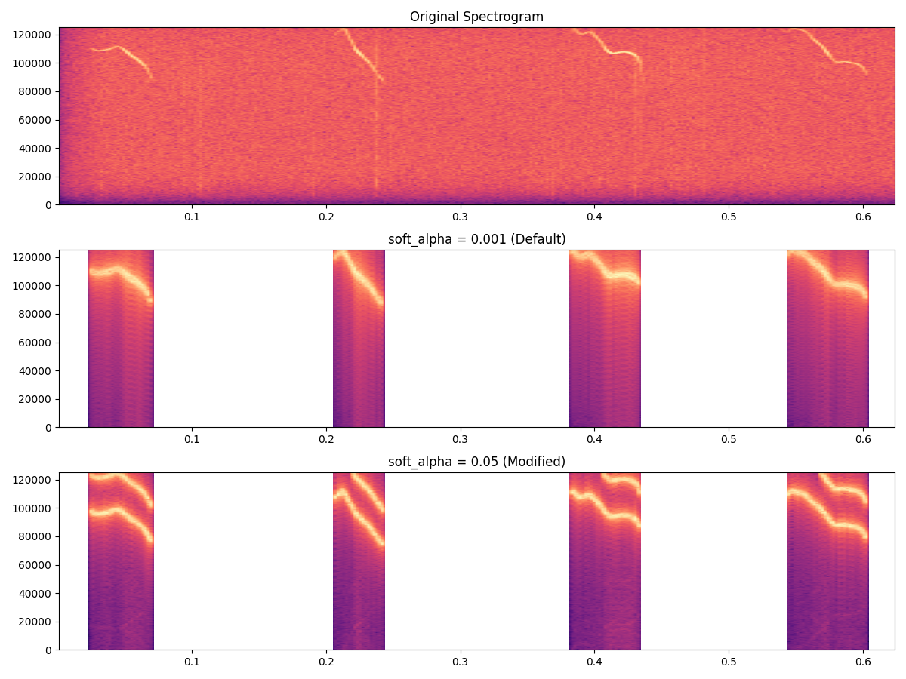
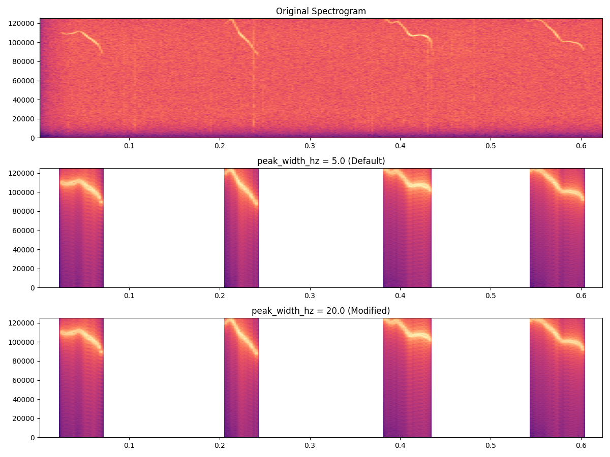
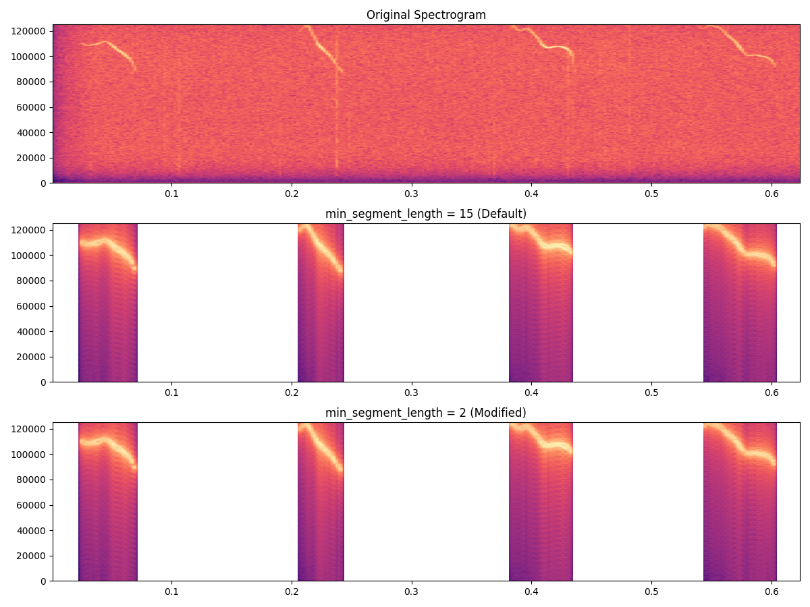
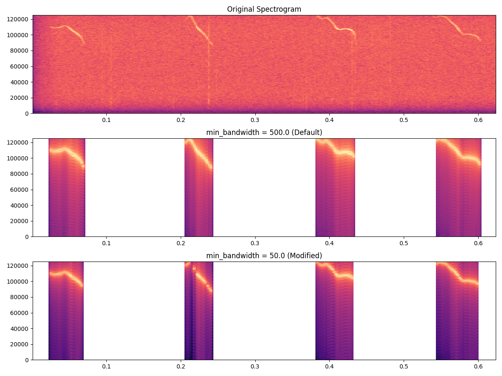
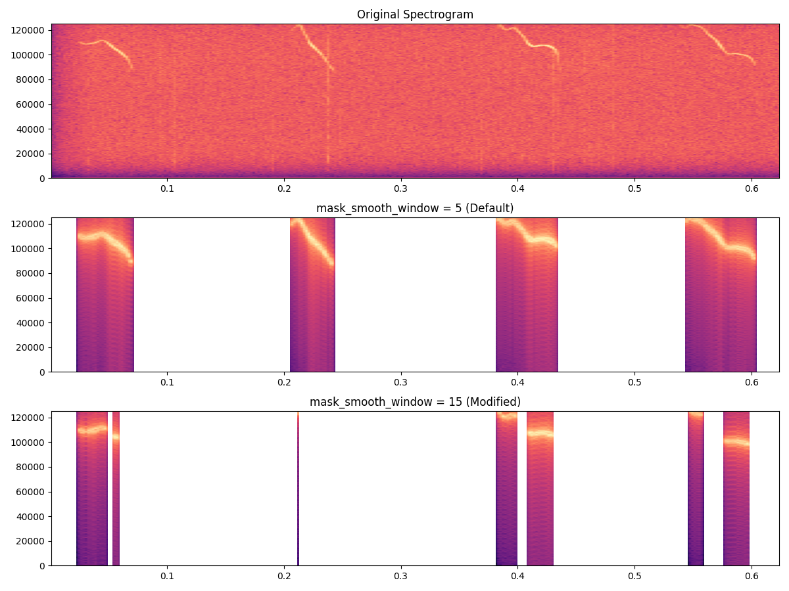

# Denoise Parameter Guide

This document provides visual comparisons and detailed explanations for each denoising parameter in the **noise2signal** pipeline, optimized for mouse vocalization audio. Use this guide to understand how each parameter affects the denoising result and to help tune them effectively.

---

## 1. Continuous Mask Parameters

### 1.1 `alpha`

- **Role:** Scales the ridge bandwidth for creating the continuous mask.
- **Default:** `0.5`
- **Test Value:** `1.5`
- **Effect:** Higher values yield broader masks, capturing more surrounding frequencies; lower values focus tightly on the detected ridge.

<em>Comparison: `alpha=0.5` (Default) vs. `alpha=1.5` (Modified)</em>

### 1.2 `keep_ratio`

- **Role:** Determines the threshold ratio for the continuous mask's bandwidth relative to the detected ridge width.
- **Default:** `0.8`
- **Test Value:** `0.4`
- **Effect:** Higher ratios preserve more of the ridge (narrow mask); lower ratios remove more background noise (wider mask).

<em>Comparison: `keep_ratio=0.8` (Default) vs. `keep_ratio=0.4` (Modified)</em>

### 1.3 `soft_alpha`

- **Role:** Bandwidth softening factor for dynamic alpha adjustment.
- **Default:** `0.001`
- **Test Value:** `0.05`
- **Effect:** Higher values create more dynamic bandwidth adjustment based on local ridge properties.

<em>Comparison: `soft_alpha=0.001` (Default) vs. `soft_alpha=0.05` (Modified)</em>

---

## 2. Peak Mask Parameters

### 2.1 `num_peaks`

- **Role:** Number of spectral peaks to include in the peak-based mask.
- **Default:** `4`
- **Test Value:** `10`
- **Effect:** More peaks capture additional harmonics or noise spikes; fewer peaks focus on the strongest frequencies.

<em>Comparison: `num_peaks=4` (Default) vs. `num_peaks=10` (Modified)</em>

### 2.2 `peak_width_hz`

- **Role:** Width in Hz around each detected peak for masking.
- **Default:** `5.0`
- **Test Value:** `20.0`
- **Effect:** Broader widths remove more adjacent noise; narrower widths preserve fine frequency detail.

<em>Comparison: `peak_width_hz=5.0` (Default) vs. `peak_width_hz=20.0` (Modified)</em>

---

## 3. Activity Detection Parameters

### 3.1 `power_threshold_db`

- **Role:** dB threshold above baseline to mark active regions.
- **Default:** `6`
- **Test Value:** `12`
- **Effect:** Higher thresholds remove low-power background noise; lower thresholds may introduce residual noise.

<em>Comparison: `power_threshold_db=6` (Default) vs. `power_threshold_db=12` (Modified)</em>

### 3.2 `min_segment_length`

- **Role:** Minimum length of active segment to be considered valid.
- **Default:** `15`
- **Test Value:** `2`
- **Effect:** Longer segments filter out brief noise bursts; shorter segments preserve transient sounds.

<em>Comparison: `min_segment_length=15` (Default) vs. `min_segment_length=2` (Modified)</em>

---

## 4. Ridge Detection and Reliability Parameters

### 4.1 `drop_db_threshold`

- **Role:** dB drop threshold to mark unreliable ridge points.
- **Default:** `10`
- **Test Value:** `2`
- **Effect:** Higher thresholds are more tolerant of power drops; lower thresholds mark more points as unreliable.

<em>Comparison: `drop_db_threshold=10` (Default) vs. `drop_db_threshold=2` (Modified)</em>

### 4.2 `freq_jump_threshold`

- **Role:** Maximum allowed ridge frequency jump in Hz.
- **Default:** `2000`
- **Test Value:** `500`
- **Effect:** Lower values enforce smoother frequency tracking; higher values allow more abrupt frequency changes.

<em>Comparison: `freq_jump_threshold=2000` (Default) vs. `freq_jump_threshold=500` (Modified)</em>

---

## 5. Bandwidth Control Parameters

### 5.1 `min_bandwidth`

- **Role:** Minimum allowed bandwidth in Hz.
- **Default:** `500.0`
- **Test Value:** `50.0`
- **Effect:** Lower values allow tighter frequency selection; higher values ensure broader coverage.

<em>Comparison: `min_bandwidth=500.0` (Default) vs. `min_bandwidth=50.0` (Modified)</em>

### 5.2 `max_bandwidth`

- **Role:** Maximum allowed bandwidth in Hz.
- **Default:** `10000.0`
- **Test Value:** `20000.0`
- **Effect:** Higher values allow wider frequency selection; lower values constrain bandwidth.

<em>Comparison: `max_bandwidth=10000.0` (Default) vs. `max_bandwidth=20000.0` (Modified)</em>

### 5.3 `bandwidth_smooth_window`

- **Role:** Smoothing window size for bandwidth estimation.
- **Default:** `7`
- **Test Value:** `1`
- **Effect:** Larger windows create smoother bandwidth transitions; smaller windows preserve rapid changes.

<em>Comparison: `bandwidth_smooth_window=7` (Default) vs. `bandwidth_smooth_window=1` (Modified)</em>

---

## 6. Mask Combination Parameters

### 6.1 `mask_contribution`

- **Role:** Weight of the continuous mask in the final combination.
- **Default:** `0.7`
- **Test Value:** `1.0`
- **Effect:** Higher values emphasize ridge-based masking; lower values reduce continuous mask influence.

<em>Comparison: `mask_contribution=0.7` (Default) vs. `mask_contribution=1.0` (Modified)</em>

### 6.2 `mask_peak_contribution`

- **Role:** Weight of the peak mask in the final combination.
- **Default:** `0.3`
- **Test Value:** `1.0`
- **Effect:** Higher values emphasize peak-based masking; lower values reduce peak mask influence.

<em>Comparison: `mask_peak_contribution=0.3` (Default) vs. `mask_peak_contribution=1.0` (Modified)</em>

---

## 7. Mask Post-Processing Parameters

### 7.1 `mask_smoothing`

- **Role:** Enable/disable temporal smoothing of the combined mask.
- **Default:** `True`
- **Test Value:** `False`
- **Effect:** Smoothing creates more natural transitions; disabling preserves sharp mask edges.

<em>Comparison: `mask_smoothing=True` (Default) vs. `mask_smoothing=False` (Modified)</em>

### 7.2 `mask_smooth_window`

- **Role:** Window size for mask smoothing (when enabled).
- **Default:** `5`
- **Test Value:** `15`
- **Effect:** Larger windows create smoother mask transitions; smaller windows preserve temporal detail.

<em>Comparison: `mask_smooth_window=5` (Default) vs. `mask_smooth_window=15` (Modified)</em>

---

## 8. Best Practices & Tuning Tips

### Parameter Tuning Strategy
1. **Start with Activity Detection**: Adjust `power_threshold_db` and `min_segment_length` to identify relevant audio segments
2. **Refine Ridge Detection**: Set `drop_db_threshold` and `freq_jump_threshold` for stable frequency tracking
3. **Optimize Bandwidth Control**: Tune `min_bandwidth`, `max_bandwidth`, and `bandwidth_smooth_window` for frequency coverage
4. **Balance Mask Components**: Adjust `alpha`, `keep_ratio`, `mask_contribution`, and `mask_peak_contribution` for optimal noise removal
5. **Fine-tune Post-processing**: Set `mask_smoothing` and `mask_smooth_window` for natural transitions

### Parameter Groups
- **Core Ridge Parameters**: `alpha`, `keep_ratio`, `soft_alpha`
- **Peak Detection**: `num_peaks`, `peak_width_hz`  
- **Activity Detection**: `power_threshold_db`, `min_segment_length`
- **Ridge Reliability**: `drop_db_threshold`, `freq_jump_threshold`
- **Bandwidth Control**: `min_bandwidth`, `max_bandwidth`, `bandwidth_smooth_window`
- **Mask Combination**: `mask_contribution`, `mask_peak_contribution`
- **Post-processing**: `mask_smoothing`, `mask_smooth_window`

### Common Use Cases
- **High SNR Mouse Calls**: Lower `power_threshold_db`, higher `keep_ratio`
- **Noisy Recordings**: Higher `power_threshold_db`, lower `alpha`
- **Harmonic Calls**: Increase `num_peaks` and `peak_width_hz`
- **Transient Sounds**: Disable `mask_smoothing`, lower `min_segment_length`

### Performance Notes
- All comparison images show: Original (top), Default parameters (middle), Modified parameters (bottom)
- Images generated from `/Users/mz/Desktop/MS_B/mice/mouse_natural_sentence.wav`
- Generated using the `contract parameters.py` script

---

*End of Parameter Guide*

